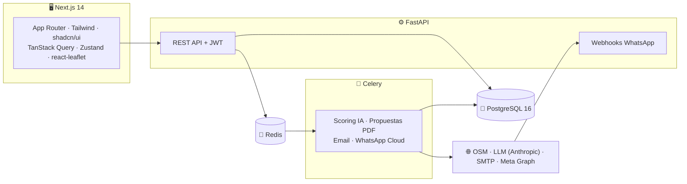

<div align="center">

# 🎯 Prospecta

**CRM de prospección para agencias de IA, automatización y marketing.**

*Encuentra negocios reales en el mapa, califícalos con IA, contáctalos con criterio humano y ciérralos con propuestas en PDF — todo en un solo flujo.*


</div>

---

## 💡 ¿Qué es?

Prospecta cubre el ciclo completo de prospección de una agencia, de punta a punta:

```
🗺️ Encontrar  →  🤖 Calificar  →  💬 Contactar  →  📄 Proponer  →  📅 Agendar  →  🤝 Cerrar
```

| | Módulo | Qué hace |
|---|---|---|
| 🗺️ | **Geo-buscador (OSM)** | Busca negocios reales por ciudad y categoría usando OpenStreetMap (Nominatim + Overpass), los pinta en un mapa interactivo y los importa como leads deduplicados. |
| 📋 | **CRM core** | Leads con kanban de etapas, filtros, historial de interacciones, importación CSV y dashboard con embudo de conversión. |
| 🤖 | **Scoring con IA** | Analiza el sitio web del lead (señales reales scrapeadas) y un LLM le asigna score, problemas detectados y oportunidades de venta. |
| 💬 | **Mensajero wa.me** | Plantillas personalizables → enlace de WhatsApp listo para que **tú** des clic y envíes. El primer contacto siempre es humano. |
| 📧 | **Email SMTP** | Preview editable de plantilla → envío asíncrono real con registro y avance automático de etapa. |
| 📄 | **Propuestas IA → PDF** | El LLM redacta diagnóstico, soluciones, precio y ROI a partir del análisis; se renderiza a PDF con el branding de tu agencia (WeasyPrint). |
| 📅 | **Agenda de citas** | Reuniones por lead con enlace "Añadir a Google Calendar" y descarga `.ics` — sin OAuth, sin fricción. |
| 🟢 | **WhatsApp Cloud API** | Webhook de entrantes, ventana de 24 h, plantillas oficiales de Meta, opt-out automático por STOP/BAJA. |
| 🧠 | **Asistente de objeciones** | Lee la conversación y sugiere hasta 3 borradores de respuesta; tú eliges, editas y envías. |
| ✍️ | **Redacción local** | Corrector y asistente de escritura **en el navegador** (Transformers.js) — gratis, sin API y sin que el texto salga de tu máquina. |

## 🧭 Filosofía: humano en el bucle

La IA **redacta, analiza y sugiere; nunca envía por ti**. El contacto en frío es siempre un clic humano (enlace wa.me), y la Cloud API solo responde a quien ya escribió — dentro de las reglas de Meta. Nada de spam automatizado.

## 🏗️ Arquitectura



**Stack:** FastAPI + SQLAlchemy + Alembic + Celery/Redis + PostgreSQL 16 · Next.js 14 (App Router) + Tailwind + shadcn/ui + TanStack Query + Zustand · LLM detrás de una interfaz `LLMProvider` intercambiable (Anthropic por defecto).

## 🚀 Arranque rápido

Requisitos: Docker Desktop.

```bash
# 1. Configura tu entorno (nunca se commitea)
cp backend/.env.example backend/.env   # edita SECRET_KEY, ADMIN_*, ANTHROPIC_API_KEY…

# 2. Levanta todo el stack
docker compose up -d

# 3. Migraciones + usuario admin
docker compose exec backend alembic upgrade head
docker compose exec backend python -m app.scripts.seed_admin
```

| Servicio | URL |
|---|---|
| Frontend | http://localhost:3000 |
| API | http://localhost:8100 |
| Swagger | http://localhost:8100/docs |

> El backend se publica en el puerto **8100** del host (el 8000 cae en un rango reservado de Windows/Hyper-V). Entra con el `ADMIN_EMAIL` / `ADMIN_PASSWORD` que definiste en `backend/.env`.

## 🗂️ Estructura

```
├── backend/          # FastAPI · SQLAlchemy · Alembic · Celery
│   └── app/
│       ├── api/routers/   # auth, leads, geo, scoring, proposals, email, wa_cloud…
│       ├── services/      # geo (OSM), llm, email, whatsapp, agenda, assistant
│       ├── workers/       # tareas Celery
│       └── models/        # ORM + migraciones
├── frontend/         # Next.js 14 · App Router
│   └── app/
│       ├── (auth)/        # login (WebGL + glass)
│       └── (dashboard)/   # dashboard, leads, buscar, plantillas
└── docker-compose.yml
```

## 🧪 Tests

```bash
docker compose exec backend pytest        # 166 tests · sin red: LLM, SMTP y Graph mockeados
cd frontend && npm run build              # verificación del frontend
```

## 🗺️ Roadmap

- [x] Fase 0–1 · Setup + CRM core (auth, leads, kanban, CSV, dashboard)
- [x] Fase 2 · Geo-buscador OpenStreetMap
- [x] Fase 3 · Scoring de leads con IA
- [x] Fase 4 · Mensajero wa.me (frío humano)
- [x] Fase 5 · Propuestas IA → PDF
- [x] Fase 6 · Email SMTP + agenda de citas (.ics / Google Calendar)
- [x] Fase 7 · WhatsApp Cloud API (entrantes, ventana 24 h, opt-out)
- [x] Fase 8a · Asistente de objeciones
- [ ] Fase 8b+ · Panel IA avanzado, multiusuario/roles, facturación

<div align="center">

Construido por fases: brainstorm → spec → plan → código 📐

**Proyecto privado** · © Gino Arez

</div>
